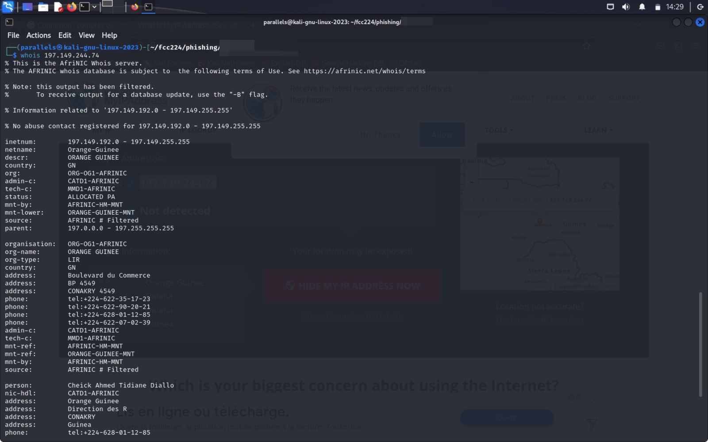

# nofish : Halte au hameçonnage (aka phishing attack)

Présentation de démonstration au **Forum de Conakry sur la cybersécurité ([FCC](https://forum-fcc.com/)) 2023** : Session d'information et démonstration sur le hameçonnage (attaque de phishing) et comment l'éviter.
---
## Sensibilisation et prévention contre les attaques par hameçonnage

### Vue d'ensemble
Ce dépôt Github est dédié à sensibiliser sur les attaques par hameçonnage, leurs méthodes et techniques de prévention.

### Qu'est-ce que l'hameçonnage ?
L'hameçonnage est un type d'attaque de social engineering souvent utilisé pour voler des données d'utilisateurs, y compris des identifiants de connexion et des numéros de cartes de crédit.

### Types courants d'hameçonnage
- **Hameçonnage par email :** Le plus répandu, utilisant des emails trompeurs comme appât ;
- **Hameçonnage ciblé :** Attaques ciblées contre des individus ou des entreprises spécifiques ;
- **Hameçonnage de baleines :** Attaques visant des cadres de haut niveau ;

### Comment reconnaître l'hameçonnage
- Vérifier les adresses email suspectes ;
- Faire attention aux liens cliquabes, surtout ceux commençant par `http://` ;
- Se méfier des salutations génériques et du langage urgent ;
- Faire attention aux fautes d'orthographe et aux erreurs grammaticales ;

---
### Live hacking démo par Francois Gonothi Toure :

---

---

---

---

---

---

---

---

---

---

---

---

---

---

### Stratégies de prévention
- Utiliser des filtres anti-spam et des logiciels antivirus ;
- Mettre en place une authentification multi-facteurs ;
- Éduquer régulièrement les employés et les utilisateurs ;

### Signalement de l'hameçonnage
- Transférer les emails d'hameçonnage à `reportphishing@antiphishing.org` ;
- Signaler les tentatives d'hameçonnage aux autorités locales telle que l'ANSSI Guinée ;

### Ressources
- [Groupe de Travail Anti-Hameçonnage](https://www.antiphishing.org/)
- [Commission Fédérale du Commerce - Hameçonnage](https://www.consumer.ftc.gov/articles/how-recognize-and-avoid-phishing-scams)

### Contribution
Les contributions à ce dépôt sont les bienvenues. Voir `CONTRIBUTING.md` pour savoir comment commencer.

### Licence
Ce projet est sous licence MIT - voir le fichier [LICENCE](LICENSE) pour plus de détails.

