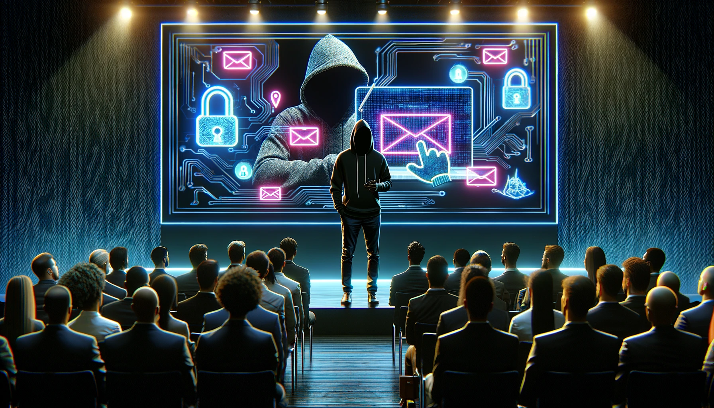

# nofish : Halte au hameçonnage (aka phishing attack)

Présentation de démonstration au **Forum de Conakry sur la cybersécurité 2023** : Session d'information et démonstration sur le hameçonnage (attaque de phishing) et comment l'éviter.
