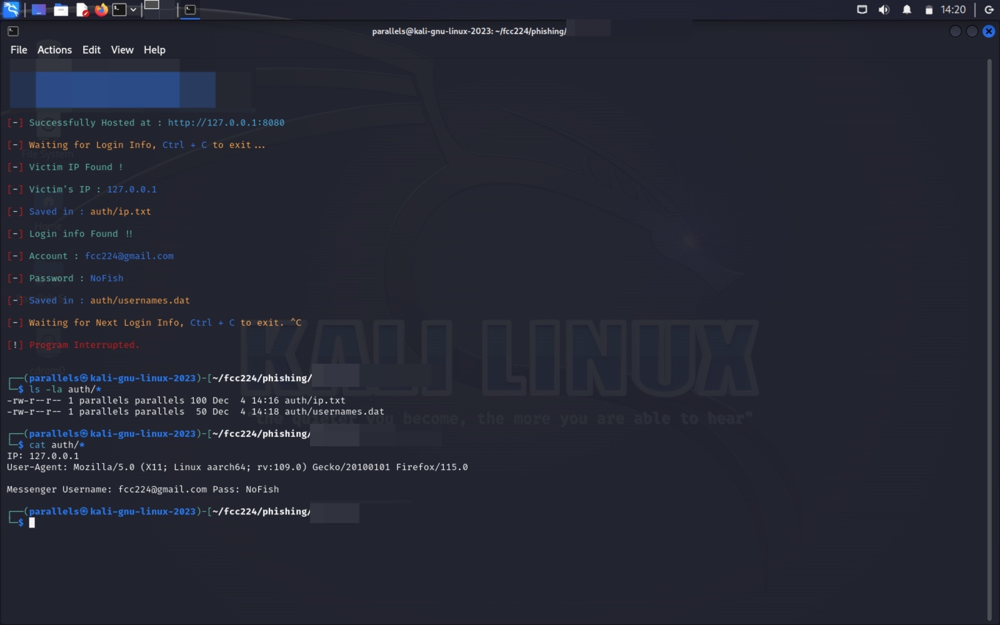

# nofish : halte aux attaques par hameçonnage (phishing attacks)

**Démo** [**live hacking**](https://forum-fcc.com/programme/#:~:text=D%C3%A9mo,15%20%2D%2015%3A30) au **Forum de Conakry sur la Cybersécurité ([FCC](https://forum-fcc.com/)) 2023** par [**Francois Gonothi Toure**](https://www.linkedin.com/in/gtfrans2re/).
- **Date** : 12 Décembre 2023
- **Heure** : 15:15 - 15:30 (GMT+0)
- **Lieu** : [Primus hôtel kaloum](https://maps.app.goo.gl/vktvJRHwYLXVavjm8), Conakry, République de Guinée

---
## Sensibilisation et prévention contre les attaques par hameçonnage (phishing attacks)

### Vue d'ensemble :
Ce dépôt Github est dédié à sensibiliser sur les attaques par hameçonnage, leurs méthodes et techniques de prévention.

### Qu'est-ce que l'hameçonnage ?
L'hameçonnage est un type d'attaque de social engineering (ingénierie sociale) souvent utilisé pour voler des données d'utilisateurs, y compris des identifiants de connexion et des numéros de cartes de crédit.

### Fonctionnement de l'hameçonnage :
L'hameçonnage est généralement effectué par e-mail, par le biais d'annonces ou via des sites qui ressemblent à ceux que vous utilisez déjà. Par exemple, vous pouvez recevoir un e-mail semblable à ceux envoyés par votre banque vous demandant de confirmer votre numéro de compte bancaire.

### Types d'informations fréquemment ciblées lors d'attaques par hameçonnage :
- Votre nom d'utilisateur et votre mot de passe ;
- Votre numéro de sécurité sociale ;
- Vos numéros de comptes bancaires ;
- Vos codes ;
- Vos numéros de cartes de crédit ;
- Le nom de jeune fille de votre mère ;
- Votre date de naissance ;

### Types courants d'hameçonnage :
- **Hameçonnage par email :** Le plus répandu, utilisant des emails trompeurs comme appât ;
- **Hameçonnage ciblé :** Attaques ciblées contre des individus, des entreprises ou institutions spécifiques ;
- **Hameçonnage de baleines :** Attaques visant des cadres de haut niveau ;

### Comment reconnaître l'hameçonnage : 
- Vérifier les adresses email suspectes ;
- Faire attention aux liens cliquabes, surtout ceux commençant par `http://` différents de `https://` ;
- Se méfier des salutations génériques et du langage urgent ;
- Faire attention aux fautes d'orthographe et aux erreurs grammaticales ;

---
### Démo Live hacking par Francois Gonothi Toure :

#### Démo 1 : Piratage de compte Facebook / Messenger :

---

---

---

---

---

---

---

---
## Démo 2 : Piratage de compte Google / Gmail :

---

---

---

---

---

---

### Stratégies de prévention
- Utiliser des filtres anti-spam et des logiciels antivirus ;
- Mettre en place une authentification multi-facteurs ;
- Éduquer régulièrement les employés et les utilisateurs ;
- Gérer les avertissements concernant les sites dangereux : [source](https://support.google.com/chrome/answer/99020) ;

### Signalement de l'hameçonnage
- Transférer les emails d'hameçonnage à `reportphishing@antiphishing.org` ;
- Faire une plainte ou rentrer en contact avec la Direction de la Police Judiciaire (DPJ) pour aide ;
- Signaler les tentatives d'hameçonnage aux autorités locales telle que l'ANSSI Guinée ;
- Éviter et signaler les escroqueries Google : [source](https://support.google.com/faqs/answer/2952493?sjid=7130095044154613612-EU)

### Ressources importantes :
- Conseils pour se protéger sur Internet : [https://support.google.com/faqs/answer/10122896](https://support.google.com/faqs/answer/10122896)
- Groupe de Travail Anti-Hameçonnage :[https://www.antiphishing.org/](https://www.antiphishing.org/)
- Commission Fédérale du Commerce - Hameçonnage : [https://www.consumer.ftc.gov/articles/how-recognize-and-avoid-phishing-scams](https://www.consumer.ftc.gov/articles/how-recognize-and-avoid-phishing-scams)

### Parcours de carrière en cybersécurité
- Organisation Cyberseek : [https://www.cyberseek.org/pathway.html](https://www.cyberseek.org/pathway.html)

### Licence
Ce projet est sous licence MIT - voir le fichier [LICENCE](LICENSE) pour plus de détails.

